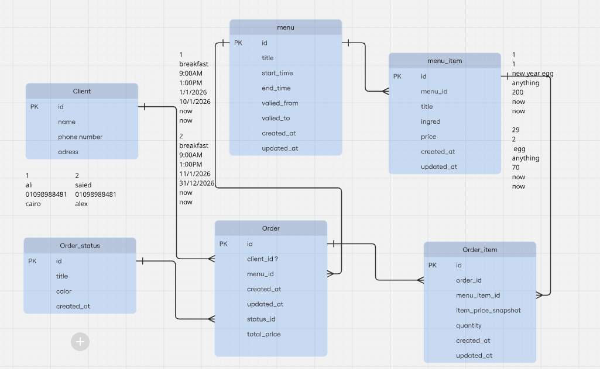

# [Video Url](https://youtu.be/hz2vm92-Rek)

- One client can place multiple orders.
- One order contains multiple menu items.
- Menu items belong to a single menu.
- Order items store quantity and price at order time.
- Orders support registered and walk-in clients.
- Orders have a defined lifecycle status.
- Order totals are stored for performance reasons.
- 
